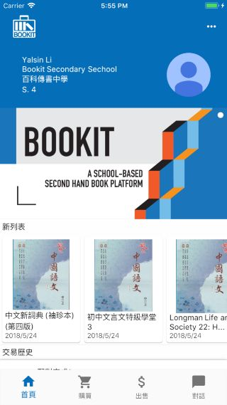
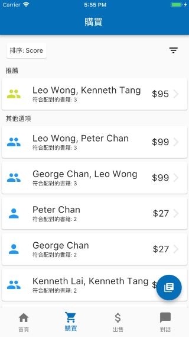
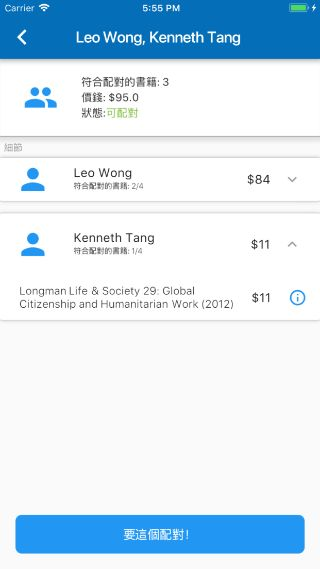
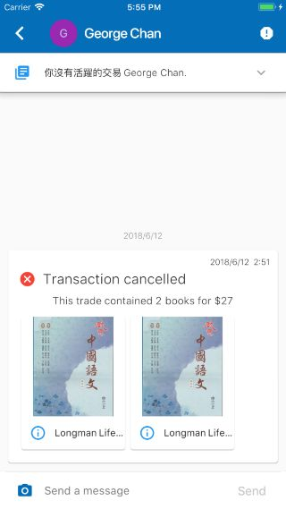

### Misc.
- This is a project archive.
- Project stack: **Flutter alpha, Django 1.11**
- Project dated **Jul 2018**
- This only contains the client app source code. 

# [Bookit 百科傳書](https://teambookit.org "Bookit 百科傳書")

- Social Enterprise for efficient second-hand textbook trades in Hong Kong via algorithmic matching, funded by the [*SIE Fund*](https://www.sie.gov.hk/en/our-work/funded-ventures/detail.page?content=1416 "*SIE Fund*") and incubated by [*the Impact Incubator*.](https://socialinnovation.org.hk/en/innovation-projects/bookit/ "*the Impact Incubator*.")
- Developed the mobile application with Flutter and backend with Django/MySQL, with heuristic solutions for the combinatorial auction problem.

 

 
